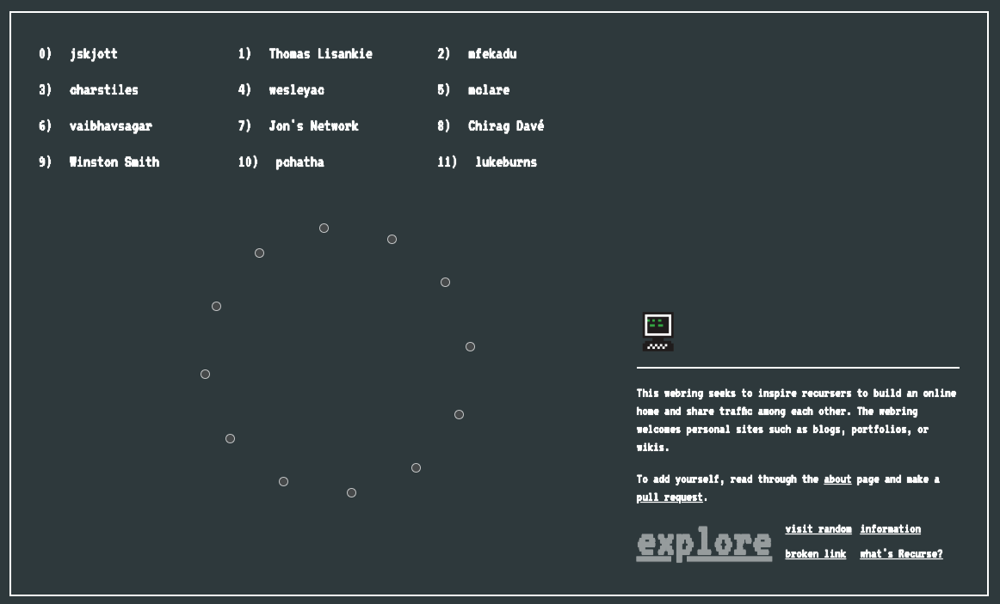

A <a href="https://webring.recurse.com">webring</a> made to **inspire recursers to build an online home** and share traffic among each other. 



## Joining the webring

To join the webring:

1. Place the RC icon linking to the webring on your site. You can use the line below:

```
<a href='https://webring.recurse.com'></a>
```

2. Add your site to the sites.js file. The URL is the only thing which is required.
3. Make a <a href="https://github.com/jskjott/webring/edit/master/sites.js">pull request</a> to add your site to the central site. Please put a comment describing where you put the webring logo on your site.


## What is a webring?

A webring is a collection of websites traditionally linked together by a circular structure. A website which is part of a webring will have an icon on its site linking either to the central webring or another site which is part of the ring.

## Who can join the webring?

The webring is open to current participants and alumns of the <a href="recurse.com">Recurse Center</a> The webring welcomes sites such as personal websites, blogs, wikis, or portfolios. The aforementioned are just examples: if your online home is something else please do still add yourself to the ring.

We discourage the additon of business sites or social media profiles.

## Contributions

This is an ongoing community project: if you want to contribute feel free to submit pull requests or contact Jonathan on Zulip.

## Ideas for new features

- Provide several ways of traversing the webring. Currently you can only traverse the ring in a circle-like pattern. Once at the central site you can click on one of the links or you can click the "random" button to visit a random page.
- Find themes shared by ring sites by doing textual analysis / topic modelling. Then allow sorting of sites based on these on the central site.
